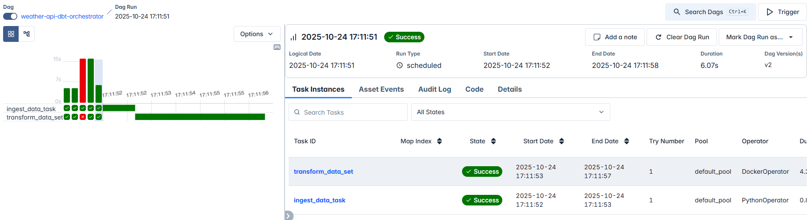

# 🌦️ Weather Data Pipeline Project  
🚀 Beginner | End-to-End Data Engineering Pipeline (Python, PostgreSQL, Airflow, dbt, Superset, Docker)

---

## 🧩 Project Overview  
This project demonstrates the creation of a **modern data pipeline** that ingests weather data from an external API, stores it in a PostgreSQL database, transforms it using dbt, orchestrates workflows via Apache Airflow, and visualizes insights in Apache Superset — all within a containerized environment using Docker.

> ⚙️ This project was developed as a hands-on learning exercise following a guided walkthrough by [Tech With Tim’s YouTube tutorial](https://youtu.be/vMgFadPxOLk?si=WK15RGHJkvRZsKP7).  
> While the walkthrough provided general guidance, the majority of **Python scripts, SQL models, configuration files, and debugging** were completed manually. The process was highly instructive and required extensive troubleshooting and problem-solving across multiple tools.

---

## 🧠 Objectives
- Build an **ETL data pipeline** from API to dashboard  
- Practice **data orchestration and automation** using Apache Airflow  
- Learn **data transformation** principles using dbt  
- Deploy **open-source analytics tools** (Superset) within Docker  
- Strengthen understanding of **end-to-end data engineering workflows**

---

## 🏗️ Tech Stack
| Layer | Tool | Purpose |
|-------|------|----------|
| Data Source | [Weatherstack API](https://weatherstack.com/) | Real-time weather data |
| Programming | Python | API requests and data ingestion |
| Storage | PostgreSQL | Data warehouse |
| Transformation | dbt (Data Build Tool) | SQL-based modeling |
| Orchestration | Apache Airflow | DAG automation |
| Visualization | Apache Superset | Data visualization |
| Infrastructure | Docker & Docker Compose | Containerized deployment |
| Environment | WSL2 (Ubuntu) + VS Code | Local development |

---

## 🔄 Workflow Summary
1. **Extract:**  
   - Fetch live weather data from Weatherstack API using Python.  
   - Store raw data in PostgreSQL via `psycopg2`.

2. **Transform (dbt):**  
   - Create staging and analytics models to clean, aggregate, and prepare data.  
   - Build models for metrics like daily averages and weather summaries.

3. **Orchestrate (Airflow):**  
   - Define DAGs for ingestion, transformation, and dependency management.  
   - Automate end-to-end flow between extract → transform → load.

4. **Visualize (Superset):**  
   - Connect to PostgreSQL models and visualize trends.  
   - Example: temperature and weather condition dashboards.

---

## 📁 Project Structure

weather-data-project/
│
├── dags/
│ ├── ingest_weather_data.py # Python script for API ingestion
│ ├── transform_data_set.py # Executes dbt transformations
│ └── orchestrator.py # Defines task dependencies
│
├── dbt/
│ ├── models/
│ │ ├── staging/
│ │ │ └── stg_weather_data.sql # Cleans and structures raw data
│ │ └── analytics/
│ │ ├── daily_average.sql # Aggregates daily metrics
│ │ └── weather_report.sql # Builds summary-level report
│ └── dbt_project.yml # dbt configuration file
│
├── docker-compose.yml # Multi-container setup
├── requirements.txt # Python dependencies
├── screenshots/
│ └── airflow_success_dag.png # Airflow DAG run confirmation
└── README.md

---

## ⚙️ Setup Instructions (Customized)

> 🧠 Note: This project was developed and tested using **WSL2 (Ubuntu)** with **Visual Studio Code** and **Docker Desktop**.

1. **Clone the repository**
   ```bash
   git clone https://github.com/GilbertWalker-DE/weather-data-pipeline.git
   cd weather-data-pipeline
Configure API Key

Create a free account at Weatherstack

Replace the placeholder in the Python ingestion script with your own API key:

python
Copy code
API_KEY = "your_api_key_here"
Start the Docker environment

bash
Copy code
docker-compose up
This command launches:

PostgreSQL (port 5000)

Airflow (port 8000)

dbt (runs on demand)

Superset (port 8088)

Redis (cache for Superset)

Trigger Airflow DAGs

Access Airflow UI: http://localhost:8000

Enable and trigger the DAG named weather-api-dbt-orchestrator

Confirm successful task completion (see screenshot in /screenshots)

Run dbt transformations (if not automated)

bash
Copy code
docker exec -it dbt_container dbt run
Access Superset for visualization

Go to http://localhost:8088

Log in with the admin credentials set during setup

Connect to the dev schema and build dashboards from the tables:

stg_weather_data

daily_average

weather_report

---

## 📸 Sample Output  
**Airflow DAG Execution:**  


---

## 🧩 Lessons Learned
- Configuring Docker containers to network across multiple services (Postgres, Airflow, dbt, Superset)  
- Troubleshooting permissions, authentication, and pathing issues within WSL2  
- Managing DAG dependencies and execution order in Apache Airflow  
- Writing modular SQL transformations within dbt  
- Setting up Superset to connect to live database tables for visualization  

---

## ✍️ Personal Note  
This was my **first full data engineering project** built from the ground up.  
While I followed a structured walkthrough, much of the implementation — including **Python ingestion scripts, SQL model development, debugging, and Docker environment setup** — was manually completed.  
It was a **highly tedious yet rewarding process** that deepened my understanding of real-world data engineering workflows.

---

## 🏁 Next Steps
- Expand dbt models with more advanced transformations (joins, rollups, CTEs)  
- Introduce data validation and quality checks  
- Deploy the full pipeline in a cloud environment (AWS RDS + MWAA)  
- Improve Superset dashboard interactivity and design  

---

## 📚 Acknowledgment
🎥 Tutorial Reference: [**End-to-End Data Engineering Project with Docker, Airflow, dbt, and Superset**](https://youtu.be/vMgFadPxOLk?si=WK15RGHJkvRZsKP7)

---

## 👤 Author
**Gilbert Walker**  
_Data Conversion Specialist | Aspiring Data Engineer_  
📍 Bethlehem, Georgia  
🔗 [GitHub: GilbertWalker-DE](https://github.com/GilbertWalker-DE)
